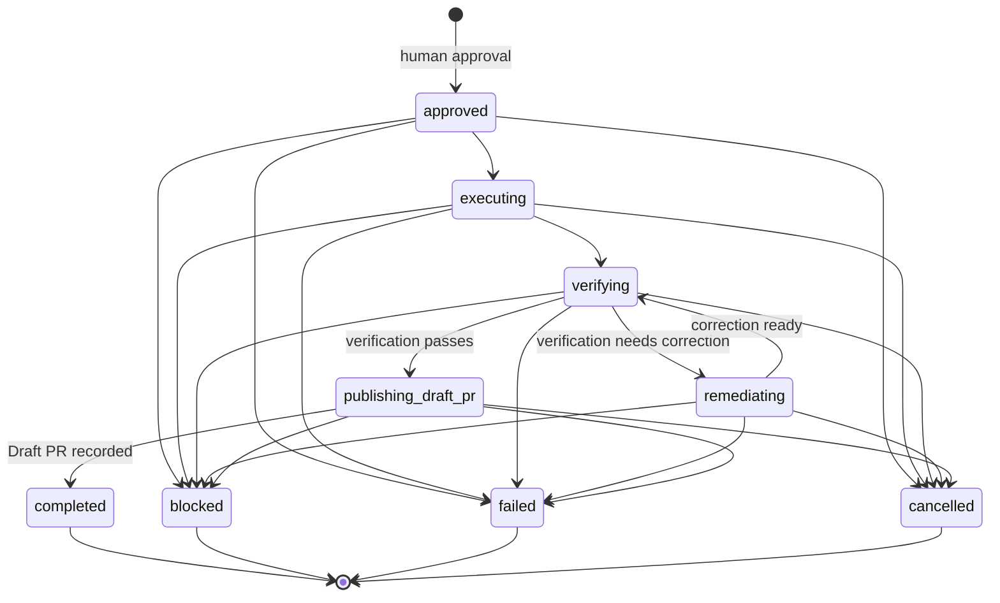

# WorkRun lifecycle

`WorkRun` is the immutable domain record for one human-approved engineering change. It correlates the Jira issue,
Horonomy repository, isolated branch, and Agent Assembly execution ID without depending on Jira, GitHub, or runtime
framework types.

## Invariants

- A run starts only at `approved`, with the approving actor and timestamp captured as event 1.
- Each transition returns a new aggregate and appends a contiguous audit event; historical events and artifacts remain
  unchanged.
- `failed`, `blocked`, `cancelled`, and `completed` are terminal.
- Completion is permitted only after an HTTPS, credential-free Draft PR URL is recorded while publishing.
- Jira and repository references use credential-free HTTPS URLs. Artifact evidence uses only `https` or `artifact`
  URIs, with optional lowercase SHA-256 integrity metadata.
- Branch, Jira issue, work-run, and Agent Assembly identifiers are validated once and remain stable for the run.

Application services must supply actor IDs and timezone-aware timestamps explicitly. This keeps replay and tests
deterministic and leaves clock, identity, persistence, and provider integrations outside the domain model.
